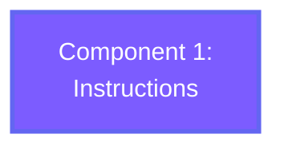
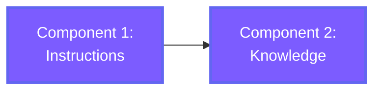
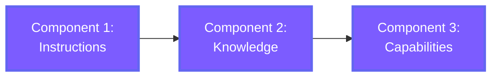

# Custom GPTs for CEOs

**Build a Custom GPT That Works Like Your Best Strategist**

Progressive Workshop (40 minutes)

---

## Today's Goal

By the end of this workshop, you'll:

1. Understand the **3 components** of a Custom GPT
2. Build a **Campaign Brief Generator** that saves 5-10 hours/week
3. Know how to **delegate** this capability to your team

<div class="metadata">
<strong>Target:</strong> CEOs who need to understand AI capabilities for strategic delegation<br/>
<strong>Duration:</strong> 40 minutes<br/>
<strong>Outcome:</strong> Working Custom GPT + rollout playbook
</div>

Note: Start with energy. Frame this as "you're not here to become a prompt engineer - you're here to understand what makes AI effective so you can direct your team."

---

## Slide 1: The CEO Problem

### You're Spending Time on Tasks That Don't Need Your Time

<table>
  <thead>
    <tr><th>Strategic Task</th><th>Requires Your Expertise?</th><th>Requires Your Time?</th><th>Time Spent</th></tr>
  </thead>
  <tbody>
    <tr><td>Board presentation briefs</td><td>✅ Yes</td><td>❌ No</td><td>2 hours</td></tr>
    <tr><td>Investor update drafts</td><td>✅ Yes</td><td>❌ No</td><td>1.5 hours</td></tr>
    <tr><td>Campaign briefs</td><td>✅ Yes</td><td>❌ No</td><td>1.5 hours</td></tr>
    <tr><td>Strategic communications</td><td>✅ Yes</td><td>❌ No</td><td>2 hours</td></tr>
  </tbody>
</table>

**Total:** 7+ hours per week on tasks that require your strategic thinking but not your direct involvement.

### The Solution

**Custom GPTs** that encode your expertise and delegate the execution.

**Timing:** 5 minutes

Note: Ask the room: "How many hours do you spend per week on briefs, decks, and strategic documents?" Get them nodding. Make the pain real. Then introduce Custom GPTs as the solution - not to replace their thinking, but to scale it.

---

## Slide 2: Component 1 — Instructions

### The DNA of Your Custom GPT

**Instructions** define:
- **Role:** "You are a strategic campaign brief generator"
- **Voice:** Professional but conversational, data-driven, action-oriented
- **Structure:** Required sections, format, quality standards
- **Behavior:** When to ask questions, how to handle edge cases

### Example: Campaign Brief Instructions

```
You are a Campaign Brief Generator for a B2B SaaS company.

Your role:
- Create comprehensive campaign briefs
- Use a professional but conversational tone
- Always include data-backed recommendations
- Reference past successful campaigns when relevant

Required brief structure:
1. Campaign Overview (2-3 sentences)
2. Target Audience (personas + pain points)
3. Key Messaging (value prop + supporting messages)
4. Channels & Tactics (prioritized with rationale)
5. Success Metrics (SMART goals)
6. Timeline & Budget
7. Creative Requirements

Quality standards:
- Be specific, not generic
- Include competitor context
- Provide actionable next steps
- Flag risks and dependencies
```

### The Difference Instructions Make

| Without Instructions | With Strategic Instructions |
|---------------------|----------------------------|
| "Campaign Overview: We will launch the product in Q2." | "Campaign Overview: Q2 product launch targeting mid-market B2B SaaS companies (50-200 employees) struggling with manual reporting. Goal: 500 qualified leads, 50 demos booked." |
| "Target Audience: Business customers" | "Target Audience: Marketing Directors at mid-market SaaS companies, frustrated with disconnected tools, need real-time visibility" |
| "Channels: Email, social media" | "Channels: LinkedIn (primary - highest engagement), targeted email sequences (secondary - lowest CPA), partner webinars (tertiary - quality over volume)" |

### Building Block 1



**Timing:** 8 minutes (13 minutes total)

Note: This is THE most important slide. Spend time here. Show the side-by-side comparison. Explain that instructions are like hiring instructions for an employee - the more specific you are, the better the output. Click through to show the building block appearing. Tell them: "This is where your strategic thinking gets encoded."

---

## Slide 3: Component 2 — Knowledge

### Your Documents = Context

**Knowledge** is how your Custom GPT learns your specific business:

**What to Upload:**
- Brand guidelines (voice, tone, messaging)
- Past successful briefs (examples to learn from)
- Product documentation (features, benefits, positioning)
- Competitive analysis (how you differentiate)
- Customer personas (who you're targeting and why)

### Context Limits

- **Storage:** Up to 20 files, 512MB each
- **Per conversation:** Processes ~50-100 pages of context
- **Best practice:** Start with 3-5 key documents

<table>
  <thead>
    <tr><th>Document Type</th><th>Why It Matters</th><th>Priority</th></tr>
  </thead>
  <tbody>
    <tr><td>Brand Voice Guide</td><td>Ensures consistent tone</td><td><span style="color: #dc2626;">HIGH</span></td></tr>
    <tr><td>Past Campaign Briefs (3-5 best)</td><td>Learn structure & quality bar</td><td><span style="color: #dc2626;">HIGH</span></td></tr>
    <tr><td>Product Positioning Doc</td><td>Accurate value props</td><td><span style="color: #dc2626;">HIGH</span></td></tr>
    <tr><td>Customer Personas</td><td>Target right audience</td><td><span style="color: #ea580c;">MEDIUM</span></td></tr>
    <tr><td>Competitive Analysis</td><td>Differentiate effectively</td><td><span style="color: #ea580c;">MEDIUM</span></td></tr>
  </tbody>
</table>

### Before & After

**WITHOUT KNOWLEDGE:**
> "Our product helps marketing teams work faster"

(Generic)

**WITH BRAND GUIDELINES:**
> "Real-time marketing analytics that eliminate manual reporting and give your team 10+ hours back every week"

(On-brand, specific, benefit-focused)

**WITH PAST BRIEFS:**
> "Campaign Overview: Following our successful Q1 product launch playbook (which generated 450 MQLs), we'll target mid-market SaaS companies with a similar multi-channel approach..."

(Learns from your wins)

### Building Blocks 1 + 2



**CEO Tip:** More isn't always better. Focused knowledge produces better results.

**Timing:** 8 minutes (21 minutes total)

Note: Emphasize quality over quantity. Show the before/after examples - let them see how knowledge transforms generic output into something that sounds like THEIR company. Add second building block to the visual. Remind them: "You now have the 'how to think' (instructions) and the 'what to know' (knowledge). One more component to go."

---

## Slide 4: Component 3 — Capabilities

### Tools Your Custom GPT Can Use

<table>
  <thead>
    <tr><th>Capability</th><th>What It Does</th><th>Use Cases</th></tr>
  </thead>
  <tbody>
    <tr><td><strong>Web Browsing</strong></td><td>Search and read web pages</td><td>Research competitors, find latest trends, verify facts</td></tr>
    <tr><td><strong>Data Analysis</strong></td><td>Process CSV/Excel files, create charts</td><td>Analyze campaign performance, identify patterns</td></tr>
    <tr><td><strong>Image Generation</strong></td><td>Create images with DALL-E</td><td>Mockups, concept visuals (rarely needed for briefs)</td></tr>
  </tbody>
</table>

### When to Enable What

- **Web Browsing:** Enable if briefs need current market data or competitive insights
- **Data Analysis:** Enable if you want to upload past campaign performance data
- **Image Generation:** Usually skip for text-based briefs

**CEO Tip:** More capabilities ≠ better output. Start minimal, add only what you need.

### Example: Web Browsing in Action

**Prompt:**
> "Create a Q2 campaign brief. First, research what our top 3 competitors launched in Q1."

**WITH WEB BROWSING ENABLED:**
```
🌐 Searching for competitor Q1 launches...
🌐 Reading TechCrunch article about Competitor A...
🌐 Analyzing Competitor B's LinkedIn campaign...

Campaign Overview:
Based on recent competitor analysis, Q1 saw a shift toward 
AI-powered features. Competitor A launched "AI Campaign 
Assistant" (March 2025, 10K signups in 3 weeks). 

Our opportunity: Position as the only tool with real-time 
analytics + AI insights. Differentiate on speed and depth.
```

(Data-informed, competitive)

### Example: Data Analysis in Action

**Prompt:**
> "Here's our Q1 campaign data. What channels performed best?"
> [Upload: q1-campaign-data.csv]

**WITH DATA ANALYSIS ENABLED:**
```
📊 Analyzing campaign performance...
📊 LinkedIn: 450 leads, $150 CPA
📊 Email: 200 leads, $75 CPA
📊 Paid Search: 100 leads, $200 CPA

Recommendation: Double down on Email (lowest CPA, highest 
ROI). Optimize LinkedIn targeting. Consider reducing Paid 
Search budget.
```

(Data-driven recommendations)

### All 3 Components Together



**You now understand all 3 components. Time to build.**

**Timing:** 8 minutes (29 minutes total)

Note: Show the capabilities in action with real examples. Make it concrete - "Here's what web browsing looks like, here's what data analysis produces." Complete the building block diagram with all 3 components. Build anticipation: "You now know the 3 pieces. Let's combine them."

---

## Slide 5: Hands-On — Build Your Campaign Brief Generator

### The Build (8 minutes)

**Step-by-Step:**

1. Go to [chatgpt.com/gpts/editor](https://chatgpt.com/gpts/editor)
2. **Name:** "Campaign Brief Generator"
3. **Description:** "Creates comprehensive campaign briefs with audience insights, messaging, and success metrics"
4. **Component 1 - Instructions:** Use template from website (or customize)
5. **Component 2 - Knowledge:** Upload 3-5 key documents:
   - Brand voice guide
   - 2-3 past successful briefs
   - Product positioning doc
6. **Component 3 - Capabilities:** Enable Web Browsing + Data Analysis
7. **Test:** "Create a brief for a Q2 product launch targeting marketing directors"
8. **Refine:** Adjust instructions based on output

### Complete System Diagram

```mermaid
graph TB
    Start([Campaign Request]) --> GPT["🎯 Campaign Brief Generator"]
    
    GPT --> Inst[Component 1:<br/>Instructions]
    GPT --> Know[Component 2:<br/>Knowledge]
    GPT --> Cap[Component 3:<br/>Capabilities]
    
    Inst --> Process[Processing...]
    Know --> Process
    Cap --> Process
    
    Process --> Output[📄 Complete Campaign Brief]
    
    Output --> Review{Review}
    Review -->|Needs refinement| Refine[Refine prompt]
    Review -->|Looks good| Team[Share with team]
    Refine --> GPT
    Team --> Execute([Execute campaign])
    
    style GPT fill:#7c5cff,stroke:#6366f1,stroke-width:4px,color:#fff
    style Inst fill:#22c55e,stroke:#16a34a,stroke-width:2px
    style Know fill:#22c55e,stroke:#16a34a,stroke-width:2px
    style Cap fill:#22c55e,stroke:#16a34a,stroke-width:2px
    style Output fill:#fbbf24,stroke:#f59e0b,stroke-width:2px
```



### ROI

<table>
  <tbody>
    <tr><td>Briefs per month</td><td>6</td></tr>
    <tr><td>Time per brief (manual)</td><td>1.5 hours</td></tr>
    <tr><td>Time with Custom GPT</td><td>10 minutes</td></tr>
    <tr><td><strong>Monthly time saved</strong></td><td><strong>7.5 hours</strong></td></tr>
    <tr><td><strong>Team of 5 → Annual savings (@$100/hr)</strong></td><td><strong>$45,000</strong></td></tr>
    <tr><td>Cost (ChatGPT Plus)</td><td>$240/year per person</td></tr>
    <tr><td><strong>Net ROI</strong></td><td><strong>37x return</strong></td></tr>
  </tbody>
</table>

### Test Prompts

1. "Create a brief for Q2 product launch targeting mid-market B2B"
2. "Research our top 3 competitors' recent campaigns, then create a brief"
3. "Here's our Q1 data [upload CSV]. What worked? Create Q2 brief based on insights."

**Timing:** 8 minutes (37 minutes total) - This is the hands-on build time

Note: This is where the workshop becomes interactive. Give them 8 minutes to actually build. Walk the room, help people who get stuck. Show the complete system diagram to illustrate how everything connects. Share the ROI to justify the time investment. Have them test their GPT with real prompts. The goal is for everyone to leave with a working Custom GPT.

---

## Slide 6: Delegate to Your Team

### Your Role as CEO

You're not here to build every Custom GPT. You're here to:

- **Understand the components** so you can evaluate what your team builds
- **Set quality standards** for instructions, knowledge, and output
- **Identify high-value use cases** worth automating
- **Track ROI** to justify continued investment

### Next Custom GPTs to Build

<table>
  <thead>
    <tr><th>Use Case</th><th>Time Savings</th><th>Owner</th></tr>
  </thead>
  <tbody>
    <tr><td>Board Presentation Brief Generator</td><td>2 hrs → 15 min</td><td>CEO/CFO</td></tr>
    <tr><td>Investor Update Draft Generator</td><td>1.5 hrs → 10 min</td><td>CEO/IR Lead</td></tr>
    <tr><td>Strategic Memo Writer</td><td>3 hrs → 20 min</td><td>Strategy Lead</td></tr>
    <tr><td>Product Launch Checklist Generator</td><td>1 hr → 5 min</td><td>Product Lead</td></tr>
    <tr><td>Customer Case Study Drafter</td><td>2 hrs → 15 min</td><td>Marketing Lead</td></tr>
    <tr><td>Competitive Analysis Summarizer</td><td>4 hrs → 20 min</td><td>Strategy/Sales</td></tr>
  </tbody>
</table>

### 30-Day Rollout Plan

**WEEK 1: Pilot Phase**
- ✓ You've built Campaign Brief Generator today
- ✓ Test with 3 real campaign briefs
- ✓ Refine based on feedback
- ✓ Document what works

**WEEK 2: Team Training**
- Share this workshop with your marketing lead
- Have them build one Custom GPT for their team
- Review together, refine instructions
- Set quality standards

**WEEK 3: Expand Use Cases**
- Identify 2-3 more high-value use cases
- Assign owners to build them
- Review all Custom GPTs in team meeting
- Share best practices

**WEEK 4: Measure & Scale**
- Track time saved across all use cases
- Calculate ROI (hours saved × hourly rate)
- Share wins with broader team
- Identify next round of use cases

### Metrics to Track

- **Adoption:** How many team members using Custom GPTs?
- **Usage:** How many briefs/documents generated per week?
- **Time Saved:** Hours saved per person per week
- **Quality:** % of AI-generated drafts approved with minimal edits
- **ROI:** (Time saved × hourly rate) - (ChatGPT Plus costs)

### CEO Cheat Sheet: Evaluating Custom GPTs

**Good Custom GPT:**
- Clear, specific instructions
- Focused knowledge (3-5 key docs)
- Capabilities match the task
- Output requires minimal editing
- Saves at least 30 minutes per use
- Team actually uses it regularly

**Needs Improvement:**
- Vague instructions ("be helpful")
- Too much knowledge (20+ docs)
- Capabilities not relevant to task
- Output needs heavy editing
- Saves less than 15 minutes per use
- Team doesn't use it (adoption problem)

### Success Story

Mid-market SaaS company (50 employees) built 8 Custom GPTs across marketing, sales, and product.

**Result:** 40 hours saved per week, $200K annual productivity gain.

**Timing:** 3 minutes (40 minutes total)

Note: End with delegation, not implementation. Remind them: "Your job is to understand what makes these effective and empower your team to build more." Share the 30-day rollout plan - make it actionable. Show the metrics to track so they can justify investment. End with the success story to inspire action. Leave them thinking: "We can do this too."

---

## Summary: Your Action Items

### What You Learned Today

1. **Component 1: Instructions** - The DNA that defines how your GPT thinks
2. **Component 2: Knowledge** - Context from your documents
3. **Component 3: Capabilities** - Tools like web browsing and data analysis
4. **Build:** Combined all 3 into Campaign Brief Generator
5. **Delegate:** 30-day rollout plan to scale across your team
6. **ROI:** How to measure and justify investment

### Your Next Steps

1. **Today:** Finish building your Campaign Brief Generator (if not done)
2. **This Week:** Test it with 3 real briefs, refine based on results
3. **Next Week:** Share this workshop with your marketing/comms lead
4. **This Month:** Build 2-3 more high-value Custom GPTs, track time savings
5. **Next Quarter:** Scale to 8-10 Custom GPTs across functions, measure ROI

### Resources

- **Workshop Site:** [Your workshop URL]
- **Custom GPT Editor:** [chatgpt.com/gpts/editor](https://chatgpt.com/gpts/editor)
- **Documentation:** [help.openai.com/custom-gpts](https://help.openai.com/en/articles/8554397-creating-a-gpt)

**Questions?**

Note: End on time (40 minutes total). Open floor for questions. If time allows, have 1-2 people share their Custom GPT with the group. Send follow-up email with this slide deck and the workshop site link.
