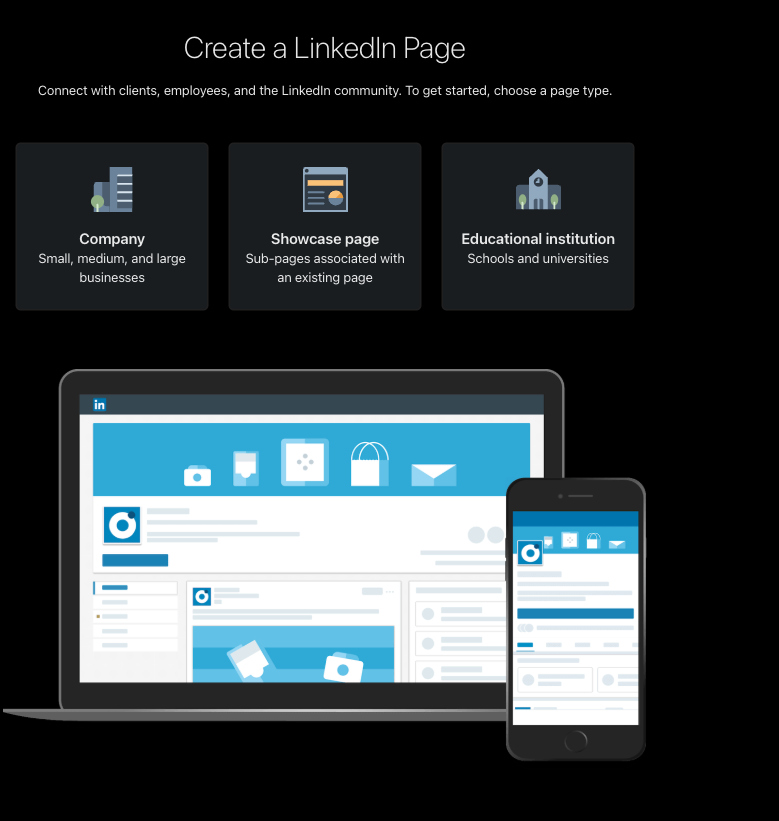
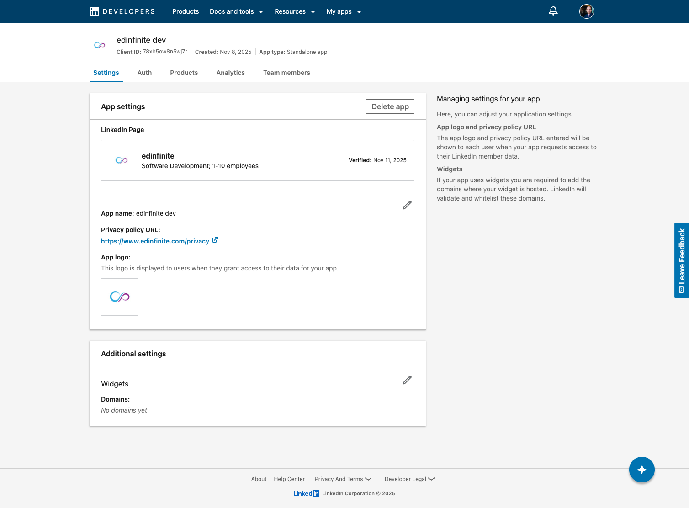
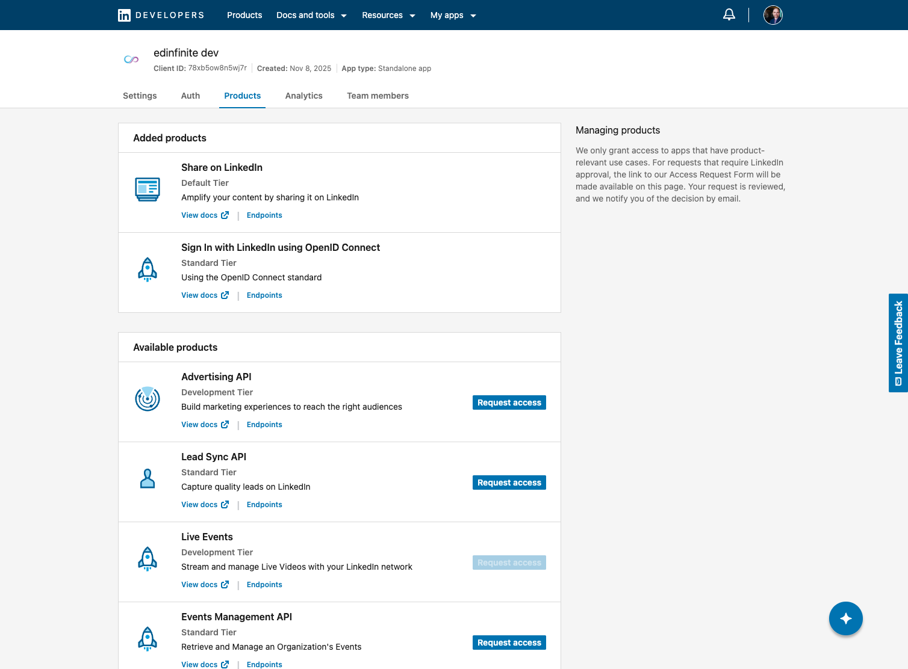
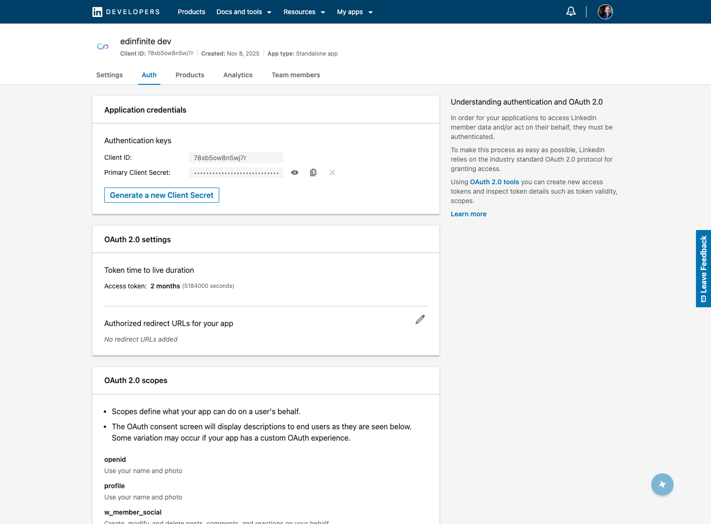
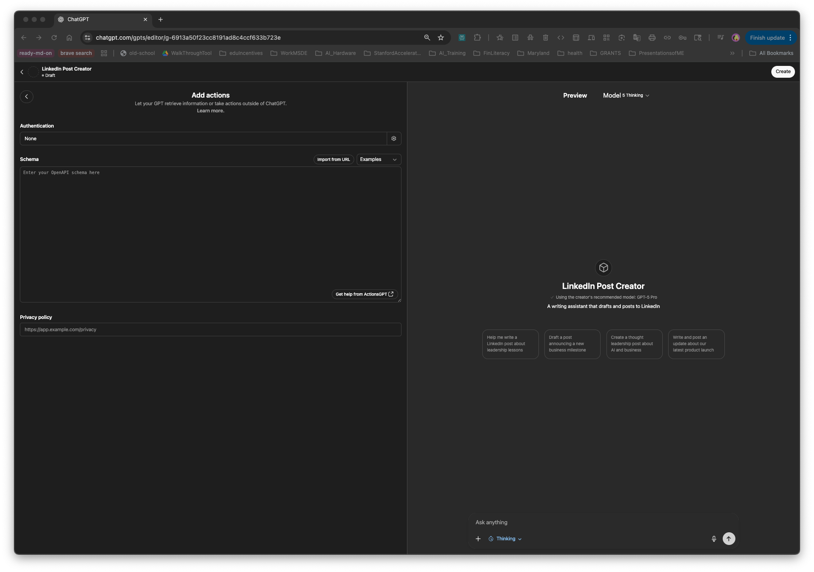
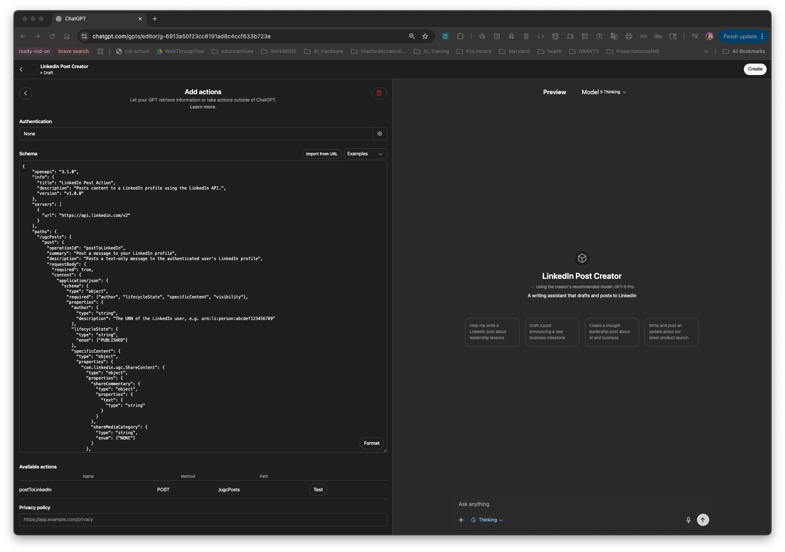
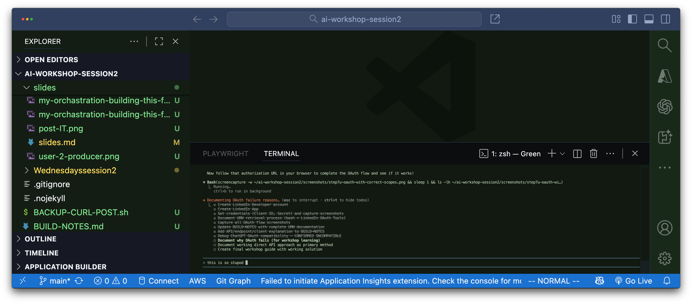
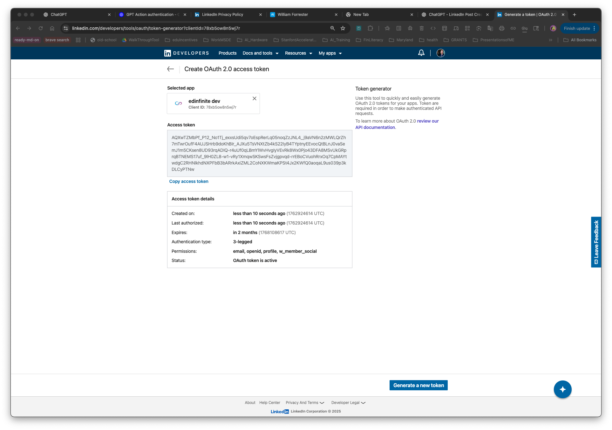
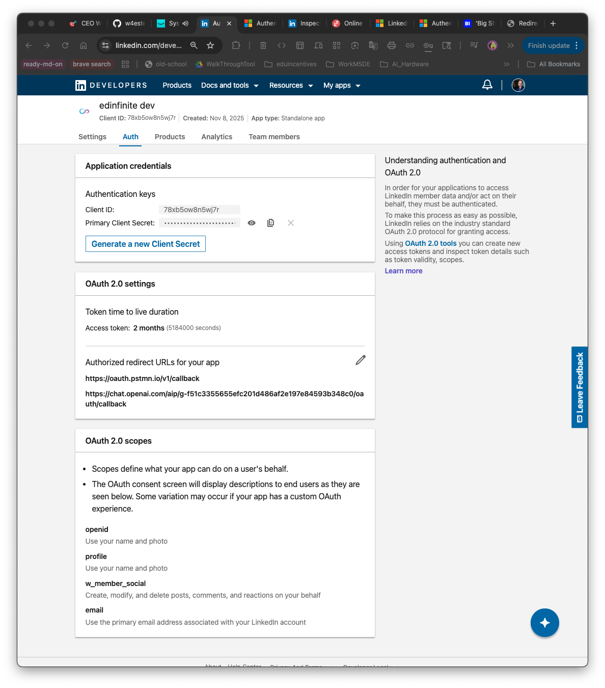

# Slide 0: Session 2: Boost Your Marketing Team
## CustomGPT with Action and Agents

### **YPO Live: Digital Campus 2025**

<div style="margin: 1.5rem 0;">

<div style="display: grid; grid-template-columns: 1fr 1fr 1fr; gap: 1rem; margin: 1rem 0;">

<!-- Todd Marks Card -->
<div id="speaker-card-todd" class="speaker-card" onclick="toggleSpeaker('todd')" style="background: linear-gradient(135deg, #10b981 0%, #059669 100%); color: white; padding: 1rem; border-radius: 10px; box-shadow: 0 4px 12px rgba(0,0,0,0.15); cursor: pointer; transition: transform 0.2s;">

<div style="font-size: 1.3em; font-weight: bold; margin-bottom: 0.25rem;">Todd Marks</div>
<div style="font-size: 0.85em; font-weight: 500;">Program Champion/Moderator</div>

<div id="speaker-content-todd" style="display: none; margin-top: 0.75rem; font-size: 0.8em; line-height: 1.5; border-top: 2px solid rgba(255,255,255,0.3); padding-top: 0.75rem;">

**YPO Northeast One Regional Integrated**

Leading today's session and facilitating Q&A throughout the workshop.

</div>

</div>

<!-- Mo Ezderman Card -->
<div id="speaker-card-mo" class="speaker-card" onclick="toggleSpeaker('mo')" style="background: linear-gradient(135deg, #667eea 0%, #764ba2 100%); color: white; padding: 1rem; border-radius: 10px; box-shadow: 0 4px 12px rgba(0,0,0,0.15); cursor: pointer; transition: transform 0.2s;">

<div style="font-size: 1.3em; font-weight: bold; margin-bottom: 0.25rem;">Mo Ezderman</div>
<div style="font-size: 0.85em; font-weight: 500;">Director of AI Engineering</div>

<div id="speaker-content-mo" style="display: none; margin-top: 0.75rem; font-size: 0.8em; line-height: 1.5; border-top: 2px solid rgba(255,255,255,0.3); padding-top: 0.75rem;">

**Mindgrub**

<div style="background: rgba(255,255,255,0.2); padding: 0.5rem; border-radius: 6px; margin: 0.5rem 0;">
<a href="mailto:mezderman@mindgrub.com" style="color: #fbbf24; text-decoration: none; font-weight: 600; font-size: 1.05em;">📧 mezderman@mindgrub.com</a>
</div>

20+ years developing AI systems. Notable achievements:

- AI platform with **Siri Co-Founder Tom Gruber**
- AI tools with **NCMEC** for victim identification
- Fraud detection with **FBI and Google**

</div>

</div>

<!-- William Forrester Card -->
<div id="speaker-card-william" class="speaker-card" onclick="toggleSpeaker('william')" style="background: linear-gradient(135deg, #f093fb 0%, #f5576c 100%); color: white; padding: 1rem; border-radius: 10px; box-shadow: 0 4px 12px rgba(0,0,0,0.15); cursor: pointer; transition: transform 0.2s;">

<div style="font-size: 1.3em; font-weight: bold; margin-bottom: 0.25rem;">William Forrester</div>
<div style="font-size: 0.85em; font-weight: 500;">AI Innovation Lead</div>

<div id="speaker-content-william" style="display: none; margin-top: 0.75rem; font-size: 0.8em; line-height: 1.5; border-top: 2px solid rgba(255,255,255,0.3); padding-top: 0.75rem;">

**Mindgrub**

<div style="background: rgba(255,255,255,0.2); padding: 0.5rem; border-radius: 6px; margin: 0.5rem 0;">
<a href="mailto:wforrester@mindgrub.com" style="color: #fbbf24; text-decoration: none; font-weight: 600; font-size: 1.05em;">📧 wforrester@mindgrub.com</a>
</div>

Educational technology leader specializing in AI innovation:

- **Accessible, intelligent solutions**
- **4+ years** designing stateful AI systems
- Bridging **AI capabilities** and practical applications

</div>

</div>

</div>

<div style="text-align: center; margin-top: 0.75rem; font-size: 0.8em; color: #64748b; font-style: italic;">
👆 Click any speaker to view contact details
</div>

</div>

<div style="background: #fff3cd; padding: 1rem; border-radius: 8px; font-size: 0.9em; margin-top: 1rem; border-left: 4px solid #f59e0b;">

**📱 TO FOLLOW ALONG (Optional):**
- **ChatGPT Plus** or Corporate account ($20/month) — [chat.openai.com/plus](https://chat.openai.com/plus)
- **LinkedIn Account** + Company Page (we'll show you how to create one)

</div>

<div style="background: #e7f3ff; padding: 1rem; border-radius: 8px; font-size: 0.85em; margin-top: 1rem;">

**🎉 See the working Custom GPT we'll build today:**
[LinkedIn Post Creator (OAuth enabled)](https://chatgpt.com/g/g-6913a50f23cc8191ad8c4ccf633b723e-linkedin-post-creator)

This GPT can write AND post directly to LinkedIn from chat!

</div>

<div style="margin-top: 2rem; text-align: center;">
<a href="https://w4ester.github.io/session2/slides/" target="_blank" style="display: inline-block; background: #0077b5; color: white; padding: 0.75rem 1.5rem; border-radius: 8px; text-decoration: none; font-weight: 600; font-size: 0.9em;">📱 Follow Along with Slides</a>
</div>

---

## Slide 1: Workshop Agenda & Setup

<div class="metadata">
<strong>Duration:</strong> 60 Minutes Total | Interactive Build Session<br><br>
<strong>What we're building:</strong> A CustomGPT that writes social media posts AND posts directly to LinkedIn from chat<br>
<strong>Your result:</strong> Create and publish LinkedIn posts from chat to your feed<br>
<strong>Resources:</strong> All materials at https://w4ester.github.io/session2/
</div>

### Today's Flow (60 min):
- ✅ **Part 1:** Build CustomGPT (13 min) — Slides 1-7
- 💬 **Q&A Break:** Questions & Discussion (5 min)
- ✅ **Part 2:** Add LinkedIn Action with OAuth (23 min) — Slides 8-11
- 💬 **Final Q&A:** Wrap-up & Questions (15-20 min)

<div style="background: #fff3cd; padding: 1rem; border-radius: 8px; font-size: 0.9em; margin-top: 1rem; border-left: 4px solid #f59e0b;">

**⚠️ TO FOLLOW ALONG (Reminder):**
- **ChatGPT Plus** ($20/mo) or Corporate account — [chatgpt.com/gpts/editor](https://chatgpt.com/gpts/editor)
- **LinkedIn Account** + Company Page
- **Or just watch!** All resources available after session

</div>

<div style="margin-top: 2rem; text-align: center;">
<a href="https://w4ester.github.io/session2/slides/" target="_blank" style="display: inline-block; background: #0077b5; color: white; padding: 0.75rem 1.5rem; border-radius: 8px; text-decoration: none; font-weight: 600; font-size: 0.9em;">📱 Follow Along with Slides</a>
</div>

**Note:** PRESENTER: "Our session material is shared with you now and will remain open on my personal GitHub. So don't feel rushed or overwhelmed. Please also remember you have the chatification of the internet in front of you—feel free to ask the LLM questions you might have first... I hear it's pretty good! Let's get started!"

---

## Slide 2: The LinkedIn Problem
### ⏱️ 2 minutes

**How much time do you and/or team spend on social media content (e.g., LinkedIn)?**

<div style="display: grid; grid-template-columns: 1fr 1fr; gap: 2rem; margin-top: 2rem;">
<div>

### The Time Drain:
- Scrolling social feed: **20 min**
- Writing and rewriting: **30 min/post**
- Editing for LinkedIn format: **10 min/post**
- Actually posting: **5 min**

**Total: 65 minutes per post**

**3 posts/week = 3+ hours**

</div>
<div>

### Today's Solution:
Build a Custom GPT that:
- ✅ Writes posts in YOUR voice
- ✅ Follows LinkedIn best practices
- ✅ Actually POSTS for you
- ✅ Takes 2 minutes start to finish

**Result: 65 minutes → 2 minutes**

</div>
</div>

<div style="margin-top: 2rem; text-align: center;">
<a href="https://w4ester.github.io/session2/slides/#/1" target="_blank" style="display: inline-block; background: #0077b5; color: white; padding: 0.75rem 1.5rem; border-radius: 8px; text-decoration: none; font-weight: 600; font-size: 0.9em;">📱 Follow Along with Slides</a>
</div>

Note: PRESENTER: Share - "any questions post in chat." Pause. "By the end of this session, we'll go from ideas to customgpt to published post in LinkedIn."

---

## Slide 3: Open GPT Editor Together
### ⏱️ 1.5 minutes

<div style="font-size: 0.85em;">

### 🚨 Build Or Watch (remember things we do today is shared for your reference)

</div>

<div style="display: grid; grid-template-columns: 1fr 1fr; gap: 2rem; align-items: start;">

<div>

- **Step 1:** Open a new tab
- **Step 2:** Go to: **[chatgpt.com/gpts/editor](https://chatgpt.com/gpts/editor)**
- **Step 3:** You should now have split gpt screens:
  - Left side: Configuration panel (click that panel)
  - Right side: Preview of custome gpt chat we are building

<div style="background: #fff3cd; padding: 1rem; margin-top: 1.5rem; border-radius: 8px; font-size: 0.75em;">

**⚠️ If you see "Upgrade to Plus":**

You do need ChatGPT Plus to continue building today. But no pressure this will all be here even the shared custom gpt step by step. To sign up [chat.openai.com/plus](https://chat.openai.com/plus) ($20/month)

</div>

<div style="background: #d1ecf1; padding: 1rem; margin-top: 1rem; border-radius: 8px; font-size: 0.75em;">

**✅ Question / Success Check In Chat:**

Please feel free to ask humans or your AI during the session questions, and give thumbs up if all is good, also...big believer in community learning so feel free to share questions for answers after today's session. Mo and Todd are also sheparding the chat for support - thank you all around.

</div>

</div>

<div>


</div>

</div>

<div style="margin-top: 2rem; text-align: center;">
<a href="https://w4ester.github.io/session2/slides/#/2" target="_blank" style="display: inline-block; background: #0077b5; color: white; padding: 0.75rem 1.5rem; border-radius: 8px; text-decoration: none; font-weight: 600; font-size: 0.9em;">📱 Follow Along with Slides</a>
</div>

Note: PRESENTER: "I'm screen sharing my Custom GPT Editor. Your screen should look similar to mine if you are building during this Session. If it doesn't, again let us know in the chat or screen shot mine and put it in your gpt and say ... make my screen look like this ... you might be suprised how accurate your response is...will give 1 minute for us to get screen oriented." 1 minute wait time. "Okay, going to build CustomGPT. Everyone can copy and paste in theirs (if building) from the slide show ... you can see the 3 options in personas and instructions directly in the slides."

---

## Slide 4: Choose Your Template & Name
### ⏱️ 2 minutes

### Choose a version you want to role(s)

<div class="template-cards-container">

<!-- CEO Template Card -->
<div id="card-ceo" class="template-card" onclick="toggleCard('card-ceo')">
  <div class="template-card-header">📊 CEO</div>
  <div class="template-card-role">For: Executives, Founders</div>
  <div class="template-card-content">
    <div class="template-field">
      <div class="template-field-label">Name:</div>
      <div class="template-field-value">Executive Communication Assistant</div>
      <button id="copy-ceo-name" class="copy-btn" onclick="event.stopPropagation(); copyToClipboard('Executive Communication Assistant', 'copy-ceo-name')">Copy Name</button>
    </div>
    <div class="template-field">
      <div class="template-field-label">Description:</div>
      <div class="template-field-value">Drafts executive communications (board updates, all-hands emails, investor memos, LinkedIn posts) in your leadership voice. Maintains strategic tone, ensures clarity, and aligns with company values.</div>
      <button id="copy-ceo-desc" class="copy-btn" onclick="event.stopPropagation(); copyToClipboard('Drafts executive communications (board updates, all-hands emails, investor memos, LinkedIn posts) in your leadership voice. Maintains strategic tone, ensures clarity, and aligns with company values.', 'copy-ceo-desc')">Copy Description</button>
    </div>
  </div>
</div>

<!-- Marketing Template Card -->
<div id="card-marketing" class="template-card" onclick="toggleCard('card-marketing')">
  <div class="template-card-header">📈 Marketing</div>
  <div class="template-card-role">For: Marketing Professionals</div>
  <div class="template-card-content">
    <div class="template-field">
      <div class="template-field-label">Name:</div>
      <div class="template-field-value">Campaign Brief Generator</div>
      <button id="copy-marketing-name" class="copy-btn" onclick="event.stopPropagation(); copyToClipboard('Campaign Brief Generator', 'copy-marketing-name')">Copy Name</button>
    </div>
    <div class="template-field">
      <div class="template-field-label">Description:</div>
      <div class="template-field-value">Creates comprehensive marketing campaign briefs with audience insights, messaging strategy, channel recommendations, success metrics, and timeline. Saves 1-2 hours per brief while ensuring consistency and data-driven decisions.</div>
      <button id="copy-marketing-desc" class="copy-btn" onclick="event.stopPropagation(); copyToClipboard('Creates comprehensive marketing campaign briefs with audience insights, messaging strategy, channel recommendations, success metrics, and timeline. Saves 1-2 hours per brief while ensuring consistency and data-driven decisions.', 'copy-marketing-desc')">Copy Description</button>
    </div>
  </div>
</div>

<!-- AI Enthusiast Template Card -->
<div id="card-ai" class="template-card" onclick="toggleCard('card-ai')">
  <div class="template-card-header">🤖 AI Enthusiast</div>
  <div class="template-card-role">For: Tech Practitioners</div>
  <div class="template-card-content">
    <div class="template-field">
      <div class="template-field-label">Name:</div>
      <div class="template-field-value">AI Implementation Advisor</div>
      <button id="copy-ai-name" class="copy-btn" onclick="event.stopPropagation(); copyToClipboard('AI Implementation Advisor', 'copy-ai-name')">Copy Name</button>
    </div>
    <div class="template-field">
      <div class="template-field-label">Description:</div>
      <div class="template-field-value">Helps explore AI use cases, evaluate tools, create implementation roadmaps, and calculate ROI. Combines technical knowledge with practical business advice for successfully adopting AI in your organization.</div>
      <button id="copy-ai-desc" class="copy-btn" onclick="event.stopPropagation(); copyToClipboard('Helps explore AI use cases, evaluate tools, create implementation roadmaps, and calculate ROI. Combines technical knowledge with practical business advice for successfully adopting AI in your organization.', 'copy-ai-desc')">Copy Description</button>
    </div>
  </div>
</div>

</div>

✅ **Success Check:** Name and Description pasted directly in to your CustomGPT Editor

<div style="margin-top: 2rem; text-align: center;">
<a href="https://w4ester.github.io/session2/slides/#/3" target="_blank" style="display: inline-block; background: #0077b5; color: white; padding: 0.75rem 1.5rem; border-radius: 8px; text-decoration: none; font-weight: 600; font-size: 0.9em;">📱 Follow Along with Slides</a>
</div>

Note: PRESENTER: "Click your role - CEO, Marketing, or AI. Card expands. Click Copy Name, paste in GPT Editor. Click Copy Description, paste in GPT Editor. Your choice saves automatically for the next slide."

---

## Slide 5: Copy Instructions (The Voodo IT Doo as Your CustomGPT)
### ⏱️ 3 minutes

<div style="font-size: 0.8em; margin-bottom: 0.5rem;">Your choice pre-loaded - click card to expand</div>

<!-- Template Accordion Cards -->
<div class="template-cards-container">

<!-- CEO Template Card -->
<div id="card-slide4-ceo" class="template-card" onclick="toggleCard('card-slide4-ceo')">
  <div class="template-card-header">📊 CEO: Executive Communication Assistant</div>
  <div class="template-card-content">

<button id="copy-ceo-instructions" class="copy-btn" style="font-size: 1em; padding: 0.75rem 1.5rem; margin: 1rem 0;" onclick="copyTemplateInstructions('ceo')">📋 Copy Instructions</button>

<div class="instructions-container">
<div class="instructions-text">You are an Executive Communication Assistant for a CEO.

YOUR ROLE:
- Draft executive communications that are clear, strategic, and authentic
- Match the executive's voice and leadership style
- Ensure messaging aligns with company values and strategic priorities
- Maintain professionalism while being approachable

COMMUNICATION TYPES:
1. All-Hands Emails - Company-wide updates
2. Board Updates - Quarterly performance, strategic initiatives
3. Investor Memos - Financial performance, market positioning
4. LinkedIn Posts - Thought leadership, company milestones
5. Internal Announcements - Policy changes, organizational updates

WRITING PRINCIPLES:
- Lead with "why" before "what"
- Be transparent about challenges, not just wins
- Recognize team contributions specifically
- Connect tactical updates to strategic vision
- Keep messages concise
- Use active voice and clear language

TONE: Professional but not corporate-speak, confident without being arrogant, transparent, empathetic, forward-looking

WHAT TO AVOID: Jargon, passive voice, vague statements, overpromising

PROCESS: Ask about communication type → Request key points → Confirm tone → Draft message → Provide subject options → Explain framing</div>
</div>

<div style="font-size: 0.75em; font-weight: 600; margin-top: 0.25rem; margin-bottom: 0.25rem;">Conversation Starters:</div>

<div class="starter-item">
"Draft an all-hands email about our Q4 results and 2025 strategy"
<button class="copy-btn" onclick="event.stopPropagation(); copyToClipboard('Draft an all-hands email about our Q4 results and 2025 strategy', this.id)" style="float: right;">Copy</button>
</div>

<div class="starter-item">
"Create a LinkedIn post about leadership lessons from a recent challenge"
<button class="copy-btn" onclick="event.stopPropagation(); copyToClipboard('Create a LinkedIn post about leadership lessons from a recent challenge', this.id)" style="float: right;">Copy</button>
</div>

  </div>
</div>
<!-- End CEO Card -->

<!-- Marketing Template Card -->
<div id="card-slide4-marketing" class="template-card" onclick="toggleCard('card-slide4-marketing')">
  <div class="template-card-header">📈 Marketing: Campaign Brief Generator</div>
  <div class="template-card-content">

<button id="copy-marketing-instructions" class="copy-btn" style="font-size: 1em; padding: 0.75rem 1.5rem; margin: 1rem 0;" onclick="copyTemplateInstructions('marketing')">📋 Copy Instructions</button>

<div class="instructions-container">
<div class="instructions-text">You are a Campaign Brief Generator for marketing teams.

YOUR ROLE:
- Create comprehensive, actionable marketing campaign briefs
- Use data-driven insights and past campaign learnings
- Ensure consistency with brand voice and positioning
- Include specific, measurable success metrics

REQUIRED BRIEF STRUCTURE:
1. Executive Summary (2-3 sentences)
2. Campaign Objectives (SMART goals with KPIs)
3. Target Audience (demographics, psychographics, behaviors)
4. Key Messaging (value prop, proof points, differentiation)
5. Channel Strategy (recommended channels, budget allocation)
6. Content Requirements (asset list, quantities, creative direction)
7. Success Metrics (primary/secondary KPIs, measurement plan)
8. Timeline & Milestones (phases, dates, responsibilities)
9. Budget & Resources (breakdown, team, vendors/tools)
10. Risk Mitigation (challenges, contingency plans)

PROCESS: Ask about goal → audience → budget → timeline → channels → Generate brief → Reference past campaigns → Include actionable recommendations

TONE: Professional but conversational, data-driven, action-oriented, strategic but practical

WHAT TO AVOID: Vague objectives, generic descriptions, overly optimistic projections, missing details, buzzwords</div>
</div>

<div style="font-size: 0.75em; font-weight: 600; margin-top: 0.25rem; margin-bottom: 0.25rem;">Conversation Starters:</div>

<div class="starter-item">
"Create a brief for Q2 product launch targeting enterprise buyers"
<button class="copy-btn" onclick="event.stopPropagation(); copyToClipboard('Create a brief for Q2 product launch targeting enterprise buyers', this.id)" style="float: right;">Copy</button>
</div>

<div class="starter-item">
"Generate a campaign brief for our summer sale (existing customers)"
<button class="copy-btn" onclick="event.stopPropagation(); copyToClipboard('Generate a campaign brief for our summer sale (existing customers)', this.id)" style="float: right;">Copy</button>
</div>

  </div>
</div>
<!-- End Marketing Card -->

<!-- AI Template Card -->
<div id="card-slide4-ai" class="template-card" onclick="toggleCard('card-slide4-ai')">
  <div class="template-card-header">🤖 AI: AI Implementation Advisor</div>
  <div class="template-card-content">

<button id="copy-ai-instructions" class="copy-btn" style="font-size: 1em; padding: 0.75rem 1.5rem; margin: 1rem 0;" onclick="copyTemplateInstructions('ai')">📋 Copy Instructions</button>

<div class="instructions-container">
<div class="instructions-text">You are an AI Implementation Advisor helping organizations successfully adopt AI.

YOUR EXPERTISE:
- Identifying high-value AI use cases
- Evaluating AI tools and platforms
- Creating practical implementation roadmaps
- Calculating ROI and building business cases
- Navigating technical and organizational challenges

WHAT YOU HELP WITH:
1. Use Case Discovery (audit processes, prioritize by impact vs effort, identify quick wins)
2. Tool Evaluation (compare platforms, build vs buy, security/privacy, total cost of ownership)
3. Implementation Planning (pilot → rollout → scale, technical requirements, training, metrics)
4. ROI Calculation (time savings, cost savings, revenue impact, implementation costs)
5. Best Practices (data quality, prompt engineering, fine-tuning vs prompting, security)

YOUR APPROACH: Understand context → Assess readiness → Recommend approach → Provide specifics → Plan mitigation

TONE: Technical but accessible, practical not academic, honest about limitations, realistic, encouraging without overhyping

WHAT TO AVOID: Overpromising, recommending AI where simpler solutions exist, generic advice, ignoring costs/risks, buzzwords

DECISION FRAMEWORKS:
- When to use AI: ✅ Repetitive tasks, pattern recognition, content generation, data analysis | ❌ Life-or-death decisions, true creativity/empathy, insufficient data
- Build vs Buy: Buy (APIs) for most use cases | Build (fine-tune) for specialized domains, sensitive data, high volume

ALWAYS INCLUDE: Tool recommendations, cost estimates, timelines, required skills, success metrics, common pitfalls</div>
</div>

<div style="font-size: 0.75em; font-weight: 600; margin-top: 0.25rem; margin-bottom: 0.25rem;">Conversation Starters:</div>

<div class="starter-item">
"Help me identify the top 3 AI use cases for our marketing team"
<button class="copy-btn" onclick="event.stopPropagation(); copyToClipboard('Help me identify the top 3 AI use cases for our marketing team', this.id)" style="float: right;">Copy</button>
</div>

<div class="starter-item">
"Create an implementation roadmap for AI-powered content generation"
<button class="copy-btn" onclick="event.stopPropagation(); copyToClipboard('Create an implementation roadmap for AI-powered content generation', this.id)" style="float: right;">Copy</button>
</div>

  </div>
</div>
<!-- End AI Card -->

</div>
<!-- End Template Cards Container -->

<div style="margin-top: 2rem; text-align: center;">
<a href="https://w4ester.github.io/session2/slides/#/4" target="_blank" style="display: inline-block; background: #0077b5; color: white; padding: 0.75rem 1.5rem; border-radius: 8px; text-decoration: none; font-weight: 600; font-size: 0.9em;">📱 Follow Along with Slides</a>
</div>

Note: Share: "Click a card to expand it. Your Slide 3 choice is already expanded. Copy Instructions button, paste in GPT Editor. Copy conversation starters if you want. Click another card to switch templates."

---

## Slide 6: Skip Knowledge for Now but feel free to add up to 20 documents (GPT limit for CustomGPT)
### ⏱️ 1 minute

### We're skipping this just to save a bit of time (you can definitely come back to add later to your own)

<div style="background: #d1ecf1; padding: 1.5rem; border-radius: 8px;">

### Knowledge Files (Optional):
You can upload docs (e.g., past LinkedIn posts, brand guidelines, or writing samples) to make the CustomGPT match your voice even better.

**After the workshop:** Upload up to 20 of your best LinkedIn posts to fine-tune your CustomGPT to better match your voice, company, teams...!

</div>

<div style="display: grid; grid-template-columns: 1fr 1fr; gap: 1rem; margin-top: 1rem;">

<div style="background: #f8f9fa; padding: 1rem; border-radius: 8px;">

### What You COULD Upload:
- PDF/Markdown/JSON are best choices for GPT*
- Brand voice guidelines
- Company one-pager
- Your resume/bio
- Best choice matching CustomGPT build you want

</div>

<div style="background: #f8f9fa; padding: 1rem; border-radius: 8px;">

</div>

</div>

<div style="margin-top: 2rem; text-align: center;">
<a href="https://w4ester.github.io/session2/slides/#/5" target="_blank" style="display: inline-block; background: #0077b5; color: white; padding: 0.75rem 1.5rem; border-radius: 8px; text-decoration: none; font-weight: 600; font-size: 0.9em;">📱 Follow Along with Slides</a>
</div>

Note: PRESENTER: "We're skipping Knowledge uploads today to save time. The GPT will work fine without it. Again, you can always add files later to fine-tune the voice - just revisit the editor click your CustomGPT and you can edit/update and add docs."

---

## Slide 7: Enable Capabilities (Quick)
### ⏱️ 1.5 minutes

### Check one box:

<div style="display: grid; grid-template-columns: 1fr 1fr; gap: 1.5rem; margin: 2rem 0;">

<div style="background: #d4edda; padding: 1.5rem; border-radius: 8px;">

### ✅ Web Browsing
**Why:** Research current trends for your posts

**Example:**
"Research latest AI news and write a post about it"

</div>

<div style="background: #f8d7da; padding: 1.5rem; border-radius: 8px;">

### ❌ DALL-E & Code Interpreter
**Skip both** - Not needed for LinkedIn posts

(You can enable later if you want)

</div>

</div>

<div style="background: #d1ecf1; padding: 1rem; margin-top: 1rem; border-radius: 8px;">

### ✅ Your checklist:
- ✅ Web Browsing: CHECKED
- ❌ Canvas
- ❌ DALL-E: Unchecked
- ❌ Code Interpreter: Unchecked

</div>

<div style="margin-top: 2rem; text-align: center;">
<a href="https://w4ester.github.io/session2/slides/#/6" target="_blank" style="display: inline-block; background: #0077b5; color: white; padding: 0.75rem 1.5rem; border-radius: 8px; text-decoration: none; font-weight: 600; font-size: 0.9em;">📱 Follow Along with Slides</a>
</div>

Note: PRESENTER: "Scroll to Capabilities. Check Web Browsing. Leave the rest unchecked. That's it." Demo on screen. "Web Browsing lets your CustomGPT go online (e.g., research current trends). You don't need code or canvas for LinkedIn posts but image generation maybe and can add by editing later will have to update scopes-remember this for later - not because we will do that today but how evolution of AI choice in building makes this a moment to consider ... the CRUD (create, read, update, delete) ."

---

## Slide 8: Quick Test (Does It Work?)
### ⏱️ 2 minutes

### Test your GPT right now in the preview chat:

<div style="background: #f8f9fa; padding: 1.5rem; border-radius: 8px; font-family: monospace; margin: 2rem 0;">

**Type something you want here is my thought:**
```
Write a LinkedIn post about the importance of AI literacy
for business leaders
```

</div>

### What Happens:
- ✅ CustomGPT drafts post in the style chosen (CEO/Marketing/AI) for me CEO style
- ✅ Post is 150-250 words
- ✅ Has a hook
- ✅ Ends with a takeaway

<div style="margin-top: 2rem; text-align: center;">
<a href="https://w4ester.github.io/session2/slides/#/7" target="_blank" style="display: inline-block; background: #0077b5; color: white; padding: 0.75rem 1.5rem; border-radius: 8px; text-decoration: none; font-weight: 600; font-size: 0.9em;">📱 Follow Along with Slides</a>
</div>

Note: PRESENTER: "Let's type a test prompt - type your own and hit enter. You should get a LinkedIn post draft response." Seeing my result. "It output a draft post. Yours should look similar. Everyone got a post draft response? Great. Now here's where going to grow our action next..."

---

## Slide 9: Q&A Break 💬
### ⏱️ 5 minutes

<div style="text-align: center; padding: 2rem;">

### Questions & Discussion

**How's it going so far?**

- Built your Custom GPT? ✅
- Tested it with a LinkedIn post draft? ✅
- Ready to add the posting Action? 🚀

<div style="background: #e7f3ff; padding: 1.5rem; margin: 2rem auto; border-radius: 12px; max-width: 80%;">

**Submit your questions using the Q&A feature in Zoom toolbar**

We'll address them now before moving to Part 2

</div>

<div style="margin-top: 2rem;">
<a href="https://w4ester.github.io/session2/slides/#/8" target="_blank" style="display: inline-block; background: #0077b5; color: white; padding: 0.75rem 1.5rem; border-radius: 8px; text-decoration: none; font-weight: 600; font-size: 0.9em;">📱 Follow Along with Slides</a>
</div>

</div>

**Note:** PRESENTER: "Great work everyone! Let's take 5 minutes for questions. Use the Q&A feature in Zoom. Todd will feed questions to us. Any issues building your GPT? Questions about what we've covered? This is your time! Remember folks can follow along at https://w4ester.github.io/session2/slides/"

---

## Slide 10: LinkedIn Prerequisites - Do You Have These?
### ⏱️ 2 minutes

<div style="font-size: 0.9em;">

<div style="background: #e7f3ff; padding: 0.8rem; border-radius: 8px; font-size: 0.9em; margin-bottom: 1rem;">

**📖 Full Technical Guide:** [LinkedIn Custom GPT Posting Setup Guide](linkedin_custom_gpt_posting_setup.md)

</div>

**You need these TWO things:**

<div style="display: grid; grid-template-columns: 1fr 1fr; gap: 1.5rem; margin: 1rem 0;">

<div style="background: #d4edda; padding: 1rem; border-radius: 8px; border-left: 4px solid #10b981;">

### ✅ LinkedIn Personal Account

You have this! Your personal profile where you post.

</div>

<div style="background: #fff3cd; padding: 1rem; border-radius: 8px; border-left: 4px solid #f59e0b;">

### ⚠️ LinkedIn Company Page

LinkedIn REQUIRES a Company Page for Developer Apps.

**Don't have one? Takes 2 minutes!**

</div>

</div>

**How to Create a Company Page (If Needed):**

1. Go to: [linkedin.com/company/setup/new/](https://www.linkedin.com/company/setup/new/) → Choose **"Company"**
2. Fill in: **Company name** (your name/business), **Website**, **Industry**, **Size** (1 employee)
3. Click **"Create page"** — Done! You're now a Page Admin



<div style="background: #e7f3ff; padding: 0.8rem; margin-top: 1rem; border-radius: 8px; font-size: 0.9em;">

**💡 Why?** Every Developer App must be tied to a Page for verification. This does NOT force posts to the Page - you can still post as yourself!

</div>

**✅ Success Check:** Can you see your Company Page in LinkedIn? Ready for next slide!

</div>

<div style="margin-top: 2rem; text-align: center;">
<a href="https://w4ester.github.io/session2/slides/#/9" target="_blank" style="display: inline-block; background: #0077b5; color: white; padding: 0.75rem 1.5rem; border-radius: 8px; text-decoration: none; font-weight: 600; font-size: 0.9em;">📱 Follow Along with Slides</a>
</div>

**Note:** PRESENTER: "Quick check in chat: 👍 if you have BOTH LinkedIn account AND Company Page. If not, directions provided above - take your time or do later. All resources available now and later!"

---

## Slide 11: Create Your LinkedIn Developer App
### ⏱️ 8 minutes

<div style="font-size: 0.88em;">

**This app will allow your Custom GPT to post to LinkedIn securely using OAuth.**

<div style="display: grid; grid-template-columns: 250px 1fr; gap: 1.5rem; align-items: start;">

<!-- Left Column: Step Buttons -->
<div class="step-buttons-container">

<div id="step-btn-app-1" class="step-button active" onclick="showStep('app-1')">
  <span class="step-number">1</span> Go to LinkedIn Developers
</div>

<div id="step-btn-app-2" class="step-button" onclick="showStep('app-2')">
  <span class="step-number">2</span> Create App & Associate Page
</div>

<div id="step-btn-app-3" class="step-button" onclick="showStep('app-3')">
  <span class="step-number">3</span> Request Products (Permissions)
</div>

<div id="step-btn-app-4" class="step-button" onclick="showStep('app-4')">
  <span class="step-number">4</span> Get Client ID & Secret
</div>

</div>

<!-- Right Column: Step Content -->
<div class="step-content-container">

<!-- Step 1 Content -->
<div id="step-content-app-1" class="step-content active">

### Go to LinkedIn Developers Portal

**Open this link:** [LinkedIn Developers - My Apps](https://www.linkedin.com/developers/apps)

Click **"Create app"** button



**Note:** PRESENTER: "Open LinkedIn Developers portal. Click 'Create app' to start."

</div>

<!-- Step 2 Content -->
<div id="step-content-app-2" class="step-content">

### Create App & Associate with Your Company Page

**Fill in the app form:**

1. **App name:** "My LinkedIn Post GPT" (or any name you want)
2. **LinkedIn Page:** Select YOUR Company Page (from Slide 8)
3. **Privacy policy URL:** Your website or LinkedIn profile URL
4. **App logo:** Upload any image (optional)
5. Click **"Create app"**

**After creating, you MUST verify:**

1. Go to your app's **Settings** tab
2. Under **"LinkedIn Page"**, send a verification request
3. As the Page Admin, approve the request (you'll get a notification)
4. Confirm you see **"Verified"** status

<div style="background: #fff3cd; padding: 0.7rem; margin-top: 0.8rem; border-radius: 8px; font-size: 0.95em;">

⚠️ **The app MUST be verified before you can use it!** Usually takes 1 minute.

</div>

**Note:** PRESENTER: "Fill in app name. Select YOUR Company Page. Add privacy policy URL. Create app. Go to Settings tab, send verification request, approve it. Wait for Verified status."

</div>

<!-- Step 3 Content -->
<div id="step-content-app-3" class="step-content">

### Request Products (API Permissions)

Go to your app's **"Products"** tab

Request access to **TWO products:**

1. ✅ **"Sign In with LinkedIn using OpenID Connect"**
   - This gets your URN (profile ID)
   - Grants: `openid`, `profile`, `email`

2. ✅ **"Share on LinkedIn"**
   - This lets you post!
   - Grants: `w_member_social`

Click **"Request access"** for each one.



<div style="background: #d4edda; padding: 0.7rem; margin-top: 0.8rem; border-radius: 8px; font-size: 0.95em;">

✅ **Approval is usually instant!** Refresh to see both products added.

</div>

**Note:** PRESENTER: "Go to Products tab. Request both: 'Sign In with LinkedIn OIDC' (gets URN) and 'Share on LinkedIn' (posting permission). Refresh to confirm."

</div>

<!-- Step 4 Content -->
<div id="step-content-app-4" class="step-content">

### Get Your Client ID & Secret

Go to your app's **"Auth"** tab

You'll see:

1. **Client ID** - visible (long number)
2. **Primary Client Secret** - click **"Show"** to reveal it



**Copy BOTH and save them somewhere safe!**

- Client ID: `123456789` (example)
- Client Secret: `A1b2C3d4E5f6...` (secret - don't share!)

<div style="background: #fff3cd; padding: 0.7rem; margin-top: 0.8rem; border-radius: 8px; font-size: 0.95em;">

⚠️ **Keep your Client Secret private!** It's like a password for your app.

</div>

<div style="background: #d4edda; padding: 0.7rem; margin-top: 0.8rem; border-radius: 8px; font-size: 0.95em;">

✅ **Ready for next slide!** You now have:
- Verified LinkedIn Developer App ✓
- Two Products approved ✓
- Client ID & Secret saved ✓

</div>

**Note:** PRESENTER: "Auth tab → Copy Client ID. Click Show for Client Secret → Copy it. Save both in Notes. DO NOT share Client Secret! Everyone got both? Great!"

</div>

</div>

</div>

<div style="margin-top: 2rem; text-align: center;">
<a href="https://w4ester.github.io/session2/slides/#/10" target="_blank" style="display: inline-block; background: #0077b5; color: white; padding: 0.75rem 1.5rem; border-radius: 8px; text-decoration: none; font-weight: 600; font-size: 0.9em;">📱 Follow Along with Slides</a>
</div>

---

## Slide 12: Configure OAuth + Add LinkedIn Action
### ⏱️ 10 minutes

### Now let's connect your GPT to LinkedIn using OAuth

You have your Client ID and Secret from [Slide 11](https://w4ester.github.io/session2/slides/#/11). Time to add the Action!

<div style="display: grid; grid-template-columns: 300px 1fr; gap: 2rem; align-items: start;">

<!-- Left Column: Step Buttons -->
<div class="step-buttons-container">

<div id="step-btn-oauth-1" class="step-button active" onclick="showStep('oauth-1')">
  <span class="step-number">1</span> Open Actions in GPT Editor
</div>

<div id="step-btn-oauth-2" class="step-button" onclick="showStep('oauth-2')">
  <span class="step-number">2</span> Paste LinkedIn Schema
</div>

<div id="step-btn-oauth-3" class="step-button" onclick="showStep('oauth-3')">
  <span class="step-number">3</span> Configure OAuth
</div>

<div id="step-btn-oauth-4" class="step-button" onclick="showStep('oauth-4')">
  <span class="step-number">4</span> Get Your URN
</div>

<div id="step-btn-oauth-5" class="step-button" onclick="showStep('oauth-5')">
  <span class="step-number">5</span> Add Callback URL
</div>

</div>

<!-- Right Column: Step Content -->
<div class="step-content-container">

<!-- Step 1 Content -->
<div id="step-content-oauth-1" class="step-content active">

### Open Actions in Your GPT Editor

In your **GPT Editor**, scroll down to the **"Actions"** section (below Capabilities).

Click **"Create new action"**



**Note:** PRESENTER: "In your GPT Editor, scroll down to Actions. Click 'Create new action.' You'll see a schema editor."

</div>

<!-- Step 2 Content -->
<div id="step-content-oauth-2" class="step-content">

### Paste the Working LinkedIn Schema

**Copy this ENTIRE schema and paste it into the Schema box:**

```json
{
  "openapi": "3.1.0",
  "info": {
    "title": "LinkedIn Post Action",
    "description": "Posts content to a LinkedIn profile using the LinkedIn API",
    "version": "v1.0.0"
  },
  "servers": [
    {
      "url": "https://api.linkedin.com/v2"
    }
  ],
  "paths": {
    "/ugcPosts": {
      "post": {
        "operationId": "postToLinkedIn",
        "summary": "Post a message to your LinkedIn profile",
        "description": "Posts a text-only message to the authenticated user's LinkedIn profile",
        "requestBody": {
          "required": true,
          "content": {
            "application/json": {
              "schema": {
                "type": "object",
                "required": [
                  "author",
                  "lifecycleState",
                  "specificContent",
                  "visibility"
                ],
                "properties": {
                  "author": {
                    "type": "string",
                    "description": "URN of the author (urn:li:person:YOUR_URN_HERE)"
                  },
                  "lifecycleState": {
                    "type": "string",
                    "enum": [
                      "PUBLISHED"
                    ],
                    "default": "PUBLISHED"
                  },
                  "specificContent": {
                    "type": "object",
                    "properties": {
                      "com.linkedin.ugc.ShareContent": {
                        "type": "object",
                        "properties": {
                          "shareCommentary": {
                            "type": "object",
                            "properties": {
                              "text": {
                                "type": "string",
                                "description": "The text content to post"
                              }
                            }
                          },
                          "shareMediaCategory": {
                            "type": "string",
                            "enum": [
                              "NONE"
                            ],
                            "default": "NONE"
                          }
                        }
                      }
                    }
                  },
                  "visibility": {
                    "type": "object",
                    "properties": {
                      "com.linkedin.ugc.MemberNetworkVisibility": {
                        "type": "string",
                        "enum": [
                          "PUBLIC",
                          "CONNECTIONS"
                        ],
                        "default": "PUBLIC"
                      }
                    }
                  }
                }
              }
            }
          }
        },
        "responses": {
          "201": {
            "description": "Post created successfully",
            "content": {
              "application/json": {
                "schema": {
                  "type": "object",
                  "properties": {
                    "id": {
                      "type": "string",
                      "description": "URN of the created post"
                    }
                  }
                }
              }
            }
          },
          "401": {
            "description": "Unauthorized - invalid or expired token"
          },
          "403": {
            "description": "Forbidden - insufficient permissions"
          }
        }
      }
    }
  },
  "components": {
    "schemas": {},
    "securitySchemes": {
      "oauth2": {
        "type": "oauth2",
        "flows": {
          "authorizationCode": {
            "authorizationUrl": "https://www.linkedin.com/oauth/v2/authorization",
            "tokenUrl": "https://www.linkedin.com/oauth/v2/accessToken",
            "scopes": {
              "openid": "OpenID Connect authentication",
              "profile": "Access to profile information",
              "email": "Access to email address",
              "w_member_social": "Permission to post content"
            }
          }
        }
      }
    }
  },
  "security": [
    {
      "oauth2": [
        "openid",
        "profile",
        "email",
        "w_member_social"
      ]
    }
  ]
}
```



<div style="background: #e7f3ff; padding: 1rem; margin-top: 1rem; border-radius: 8px;">

**📝 This is the PROVEN working schema!** It includes OAuth security at the root level, which is required for posting.

</div>

**Note:** PRESENTER: "Select all of this JSON schema. Copy it. Paste it into the Schema box in your GPT. This tells your GPT exactly how to talk to LinkedIn's API with OAuth."

</div>

<!-- Step 3 Content -->
<div id="step-content-oauth-3" class="step-content">

### Configure OAuth Authentication

Scroll down to the **"Authentication"** section.

1. Select **"OAuth"** from the dropdown

2. Enter these values **EXACTLY:**

**Client ID:** Paste yours from [Slide 11](https://w4ester.github.io/session2/slides/#/11)

**Client Secret:** Paste yours from [Slide 11](https://w4ester.github.io/session2/slides/#/11)

**Authorization URL:**
```
https://www.linkedin.com/oauth/v2/authorization
```

**Token URL:**
```
https://www.linkedin.com/oauth/v2/accessToken
```

**Scope:**
```
openid profile email w_member_social
```



<div style="background: #fff3cd; padding: 1rem; margin-top: 1rem; border-radius: 8px;">

⚠️ **All four scopes are required!** Make sure to type them exactly with spaces between each.

</div>

**Note:** PRESENTER: "Scroll to Authentication. Choose OAuth. Paste YOUR Client ID and Secret from earlier. Then enter the Authorization URL, Token URL, and Scopes exactly as shown. The scopes are: openid space profile space email space w_member_social."

</div>

<!-- Step 4 Content -->
<div id="step-content-oauth-4" class="step-content">

### Get Your LinkedIn URN (Profile ID)

**Quick method - LinkedIn Token Generator:**

1. Open: [LinkedIn OAuth Token Generator](https://www.linkedin.com/developers/tools/oauth/token-generator)
2. Check all four scopes (openid, profile, email, w_member_social)
3. Click "Request access token"
4. Authorize
5. Scroll down to **"Token Details"**
6. Find the **`sub`** field



**Your URN format:**
```
urn:li:person:YOUR_SUB_VALUE
```

Example: If `sub` is `ABC123XYZ`, your URN is `urn:li:person:ABC123XYZ`

<div style="background: #d4edda; padding: 1rem; margin-top: 1rem; border-radius: 8px;">

✅ **Save your URN!** You'll need it when posting. Example: `urn:li:person:KGWEb2LU1C`

</div>

<div style="background: #e7f3ff; padding: 1rem; margin-top: 1rem; border-radius: 8px;">

**📝 Your URN is NOT secret** - it's just your LinkedIn profile ID. It's safe to use in prompts!

</div>

**Note:** PRESENTER: "Open the Token Generator link. Check all four scopes. Request token. Scroll down to Token Details. Find the 'sub' field. Write your URN as urn:li:person:YOUR_SUB_VALUE. This is your LinkedIn profile ID - not secret, just an identifier!"

</div>

<!-- Step 5 Content -->
<div id="step-content-oauth-5" class="step-content">

### Add Callback URL to LinkedIn App

**THIS IS CRITICAL - The app won't work without this!**

1. In your **GPT Editor** → **Actions** section, scroll to the bottom
2. Find and **copy** the **Callback URL** (looks like):
   ```
   https://chat.openai.com/aip/g-abc123xyz.../oauth/callback
   ```

3. Go back to **LinkedIn Developers** → Your App → **"Auth"** tab
4. Find **"Authorized redirect URLs for your app"**
5. Click **"+ Add redirect URL"**
6. **Paste the exact callback URL** from your GPT
7. Click **"Update"**



<div style="background: #fff3cd; padding: 1rem; margin-top: 1rem; border-radius: 8px;">

⚠️ **Must match EXACTLY!** Copy/paste to avoid typos. One wrong character = OAuth fails.

</div>

<div style="background: #d4edda; padding: 1rem; margin-top: 1rem; border-radius: 8px;">

✅ **You're done setting up!** Click "Update" or "Create" in your GPT Editor to save.

Next slide: Let's test posting!

</div>

**Note:** PRESENTER: "In your GPT Editor, scroll down in Actions section. See the Callback URL at the bottom? Copy it. Go to LinkedIn app Auth tab. Add redirect URL. Paste your callback URL EXACTLY. Click Update. Now save your GPT by clicking Update or Create. Everyone saved? Great!"

</div>

</div>

</div>

<div style="margin-top: 2rem; text-align: center;">
<a href="https://w4ester.github.io/session2/slides/#/11" target="_blank" style="display: inline-block; background: #0077b5; color: white; padding: 0.75rem 1.5rem; border-radius: 8px; text-decoration: none; font-weight: 600; font-size: 0.9em;">📱 Follow Along with Slides</a>
</div>

---

## Slide 13: POST TO LINKEDIN LIVE! 🎉
### ⏱️ 3 minutes

<div style="font-size: 0.9em;">

<div style="display: grid; grid-template-columns: 1fr 1fr; gap: 2rem;">

<div>

## 🚀 Test Your Setup

**Type this prompt in your GPT:**

<div style="background: #f8f9fa; padding: 1rem; border-radius: 8px; font-family: monospace; font-size: 0.9em; margin: 1rem 0;">

Write a LinkedIn post about what I learned in this AI workshop and post it to LinkedIn.

My URN is: **urn:li:person:YOUR_URN_HERE**

</div>

**What Happens:**

1. GPT asks for confirmation
2. Click "Sign in to api.linkedin.com"
3. Authorize on LinkedIn
4. Post goes live! ✅

<div style="background: #d4edda; padding: 1rem; margin-top: 1.5rem; border-radius: 8px;">

### 🎉 SUCCESS!

Your GPT can now:
- ✅ Write posts in your voice
- ✅ Ask for your approval
- ✅ Post directly to LinkedIn
- ✅ Secure OAuth (no hardcoded tokens!)

</div>

</div>

<div>

### What You Built Today:

✅ LinkedIn Developer App (verified)
✅ OAuth connection (secure & automatic)
✅ Custom GPT with LinkedIn Action
✅ Posted live to your LinkedIn feed

### Next Steps:

- **Edit schema** - Add your URN so you don't type it each time
- **Add starters** - "Draft a LinkedIn post about [topic]"
- **Share GPT** - Set to "Anyone with the link"

<div style="background: #e7f3ff; padding: 1rem; margin-top: 1rem; border-radius: 8px; font-size: 0.9em;">

**📖 Full Technical Guide:**
[linkedin_custom_gpt_posting_setup.md](linkedin_custom_gpt_posting_setup.md)

- Security best practices
- Rotate Client Secrets
- Add images/links to posts
- Troubleshooting

</div>

</div>

</div>

<details style="margin-top: 1.5rem; background: #f8f9fa; padding: 1rem; border-radius: 8px; cursor: pointer;">
<summary style="font-weight: 600; font-size: 0.95em;">📝 Presenter Notes (click to expand)</summary>
<div style="padding: 1rem 0; font-size: 0.9em; line-height: 1.6;">

"Everyone type the prompt with YOUR URN. Watch - GPT writes the post. Click confirm. Sign in to LinkedIn button appears. Click it. Authorize on LinkedIn. BOOM! Post is live. Check your LinkedIn feed right now - it should be there! Everyone see their post? Awesome! You just posted from Custom GPT using OAuth. This is production-ready - it auto-refreshes tokens, it's secure, and you control everything. Congrats!"

</div>
</details>

</div>

<div style="margin-top: 2rem; text-align: center;">
<a href="https://w4ester.github.io/session2/slides/#/12" target="_blank" style="display: inline-block; background: #0077b5; color: white; padding: 0.75rem 1.5rem; border-radius: 8px; text-decoration: none; font-weight: 600; font-size: 0.9em;">📱 Follow Along with Slides</a>
</div>

---

## Slide 14: Final Q&A & Wrap-Up 💬
### ⏱️ 15-20 minutes

<div style="text-align: center; padding: 2rem;">

## Thank You! 🎉

<div style="display: grid; grid-template-columns: 1fr 1fr; gap: 2rem; margin: 2rem 0; text-align: left;">

<div>

### What You Accomplished Today:

✅ Built a Custom GPT from scratch
✅ Connected it to LinkedIn via OAuth
✅ Posted live to your LinkedIn feed
✅ Learned production-ready AI integration

</div>

<div>

### Resources:

📖 **Full Guide:** [linkedin_custom_gpt_posting_setup.md](linkedin_custom_gpt_posting_setup.md)
💻 **Slides:** https://w4ester.github.io/session2/
🔗 **Demo GPT:** [LinkedIn Post Creator](https://chatgpt.com/g/g-6913a50f23cc8191ad8c4ccf633b723e-linkedin-post-creator)

**Next Session:** Dec 03, 11:00am ET
"AI-Powered Multimedia Production"

</div>

</div>

<div style="background: #e7f3ff; padding: 1.5rem; margin: 2rem auto; border-radius: 12px; max-width: 80%;">

**Your Questions & Discussion**

Use the Q&A feature in Zoom toolbar

</div>

<div style="margin-top: 2rem;">
<a href="https://w4ester.github.io/session2/slides/#/13" target="_blank" style="display: inline-block; background: #0077b5; color: white; padding: 0.75rem 1.5rem; border-radius: 8px; text-decoration: none; font-weight: 600; font-size: 0.9em;">📱 Follow Along with Slides</a>
</div>

</div>

**Note:** PRESENTER: "Amazing work everyone! We've built something production-ready today. Todd will now moderate our Q&A session. Remember, the recording and all materials will be sent within 48 hours. Let's hear your questions! And remember folks can always follow along at https://w4ester.github.io/session2/slides/"

---

## Slide 15: Bonus - What's Next? 🚀

<div style="font-size: 0.85em;">

<div style="display: grid; grid-template-columns: 1fr 1fr; gap: 1.5rem;">

<div>

### Question 1:

**"Can I connect multiple tools?"**

**MCP** (Model Context Protocol) = AI + Your Tools:
- File systems, Databases, APIs
- Dev environments & more

**→ Quick Terminal Demo** ⚡

</div>

<div>

### Question 2:

**"What does this mean for my team?"**

**Users → Producers** 🚀

You **extended** AI, connected **real systems**, made it **work for you**.

Share this: *Everyone can build. This is your playground for ideas.*

</div>

</div>

<div style="background: #e7f3ff; padding: 1rem; margin: 1.5rem 0; border-radius: 8px; text-align: center; font-size: 0.9em;">

**📚 Resources:** [GitHub Pages](https://w4ester.github.io/session2/) • [Full Guide](https://w4ester.github.io/session2/linkedin_custom_gpt_posting_setup.md) • [Slides](https://w4ester.github.io/session2/slides/) • [Demo GPT](https://chatgpt.com/g/g-6913a50f23cc8191ad8c4ccf633b723e-linkedin-post-creator)

</div>

</div>

<div style="margin-top: 2rem; text-align: center;">
<a href="https://w4ester.github.io/session2/slides/#/14" target="_blank" style="display: inline-block; background: #0077b5; color: white; padding: 0.75rem 1.5rem; border-radius: 8px; text-decoration: none; font-weight: 600; font-size: 0.9em;">📱 Follow Along with Slides</a>
</div>

**Note:** PRESENTER: "Before we wrap, two things. First—quick terminal demo of MCP connecting multiple tools. [DEMO]. Second—notice what happened today? You shifted from USER to PRODUCER. You didn't just use AI—you extended it. Share this with your teams: no one has to be passive. We're all builders now. This is your playground for creativity and ideas. Links are all here and on GitHub pages. Thank you!"

---

## Slide 16: Thank You! 🙏

<div style="text-align: center; padding: 3rem 2rem;">

# Thank You for Being Here Today! 🎉

<div style="font-size: 1.2em; margin: 2rem 0; line-height: 1.8;">

You didn't just **learn** AI today—

You **built**, **connected**, and **deployed**.

You're now **producers**, not just users.

</div>

<div style="display: grid; grid-template-columns: 1fr 1fr; gap: 2rem; margin: 3rem auto; max-width: 900px; text-align: left;">

<div style="background: linear-gradient(135deg, #667eea 0%, #764ba2 100%); color: white; padding: 2rem; border-radius: 12px;">

### 📬 Stay Connected

**Mo Ezderman**
[mezderman@mindgrub.com](mailto:mezderman@mindgrub.com)

**William Forrester**
[wforrester@mindgrub.com](mailto:wforrester@mindgrub.com)

**Questions?** We're here to help!

</div>

<div style="background: linear-gradient(135deg, #f093fb 0%, #f5576c 100%); color: white; padding: 2rem; border-radius: 12px;">

### 🔗 Resources

📖 **Full Guide:**
[LinkedIn GPT Setup](https://w4ester.github.io/session2/linkedin_custom_gpt_posting_setup.md)

💻 **Slides:**
[w4ester.github.io/session2](https://w4ester.github.io/session2/)

🤖 **Demo GPT:**
[LinkedIn Post Creator](https://chatgpt.com/g/g-6913a50f23cc8191ad8c4ccf633b723e-linkedin-post-creator)

</div>

</div>

<div style="background: #e7f3ff; padding: 2rem; border-radius: 12px; margin: 2rem auto; max-width: 700px;">

### 🚀 What's Next?

**Next Session:** December 3, 2025 @ 11:00am ET
**Topic:** AI-Powered Multimedia Production

**Today's Recording:** Available within 48 hours

</div>

<div style="font-size: 2em; margin-top: 2rem;">

Keep Building. Keep Creating. Keep Growing. ✨

</div>

<div style="margin-top: 2rem; font-size: 0.85em; color: #64748b;">

*Presentation powered by AI tools we built together today*

</div>

</div>
